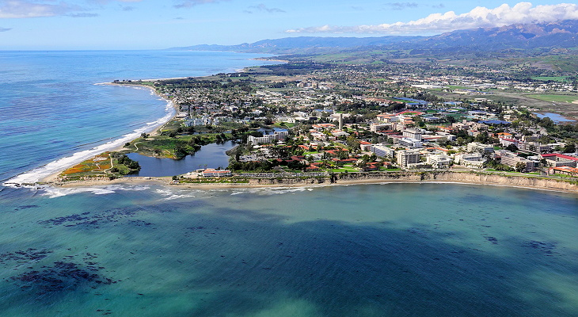

<i>The breeze which heaven has sent We must endure, and toil without complaining.</i>  ― Marcus Aurelius, Meditations

I did my undergrad at UC Santa Barbara in Physics and Statistical Science with an emphasis in Probability and Statistics. 

Yes, that is really what it looks like. UCSB is one of the most beautiful Universities in the world. My professional experience includes data science projects, deep learning, financial metrics, creating production level code, and sharing insights.

In the past, I have done contract work in Data Science, as well as Pre-Sales and writing technical marketing content. I have done it all, from dropping off succulents with notes to call our inside sales team and organizing binders of marketing content to launching a machine learning model into production and presenting to stakeholders. As I expand my experience and try new things, I hope to find an avenue where I can provide maximum impact.

I have made this website a home for my various work and a couple machine learning projects in the [Projects](/categories/projects/) tab, which should be growing soon now that it is up and running. 

I am an avid guitar player and music lover. My interests are in finance and algorithmic trading, reading, cooking, and running. If you would like to connect with me, please feel free to shoot me an email or reach out on social.