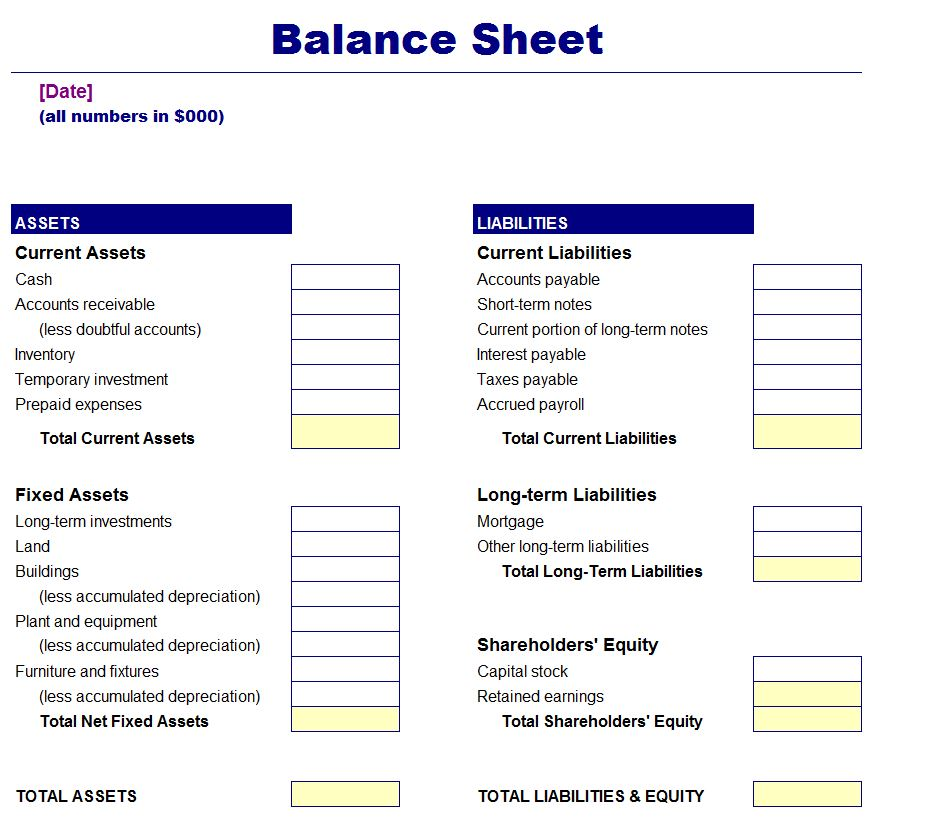
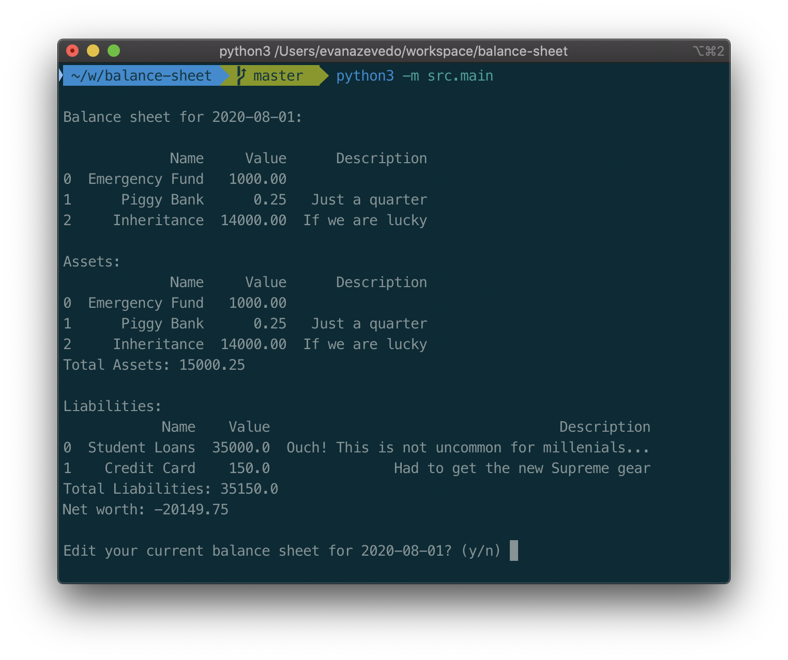

Yes, I am a geek. I enjoy personal finance as well as developing in Python, so I created a Python package called `balance-sheet` to track your net worth. And they say millenials are not money-savy.  

I tried to make one in Excel, and it just felt too clunky. Plus, I feel more comfortable with Python and SQL than Excel anyways and wanted to do some analytics on my data after I have a couple months of data. This was also my first Python package hosted on PyPI so this is exciting for me. The cool thing about this package, is that it uses SLQlite and only Python3's standard library, so it is lightweight and easy to use.  

## What is a Balance Sheet?
A [balance sheet](https://www.investopedia.com/terms/b/balancesheet.asp) is simply a list of your assets and liabilities, and your net worth. Different entities will have different needs for a balance sheet, such as a small business which would need to track inventory costs, possibly cash flow, and other variables. For now, this application is designed just for personal use. In either case all it comes down to assets, liabilities, and net worth.  



The simple way to describe assets and liabilities is that assets are things that put money into your pocket, while liabilities take money out. A common misconception is that your car is an asset. How much money does your car earn you per year? More than likely you actually pay for your car in gas, car insurance, maitenance, and depreciation. This makes your car actually a liability. 

* Assets: Assets are items that add to your net worth. They often are cash reserves, stores of wealth such as jewlery or art work, cash flowing assets such as dividend stocks or real estate, or even part of a business. These are the things that you want when you play the money game.
* Liabilities: Liabilities are items that decrease your net worth. These typically lose their value over time, such as a car or peice of clothing, or they cost you money in terms of expenses.
* Net worth: Net worth is simply your assets minus your liabilities.

## How do I use it?
You interact with the application from the terminal window. It allows you to track your assets and liabilities and carries your balance sheet from month to month. 



You can install the package from PyPi with:  

```pip install balance-sheet```

Check out the Github repo [here](https://github.com/evanaze/balance-sheet). I feedback or help is appreciated!