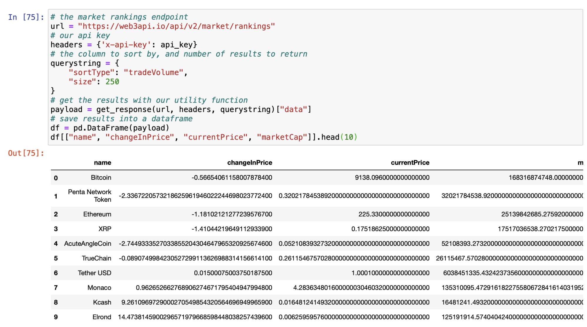
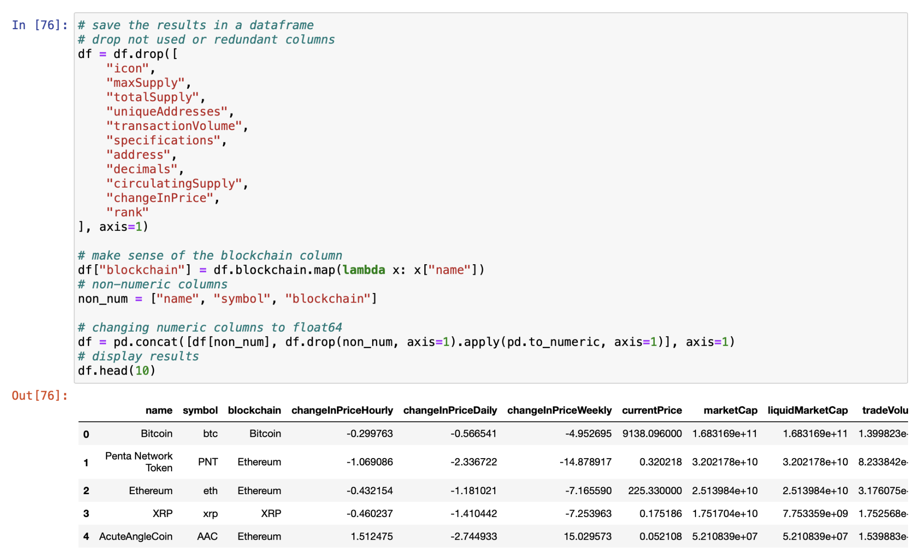
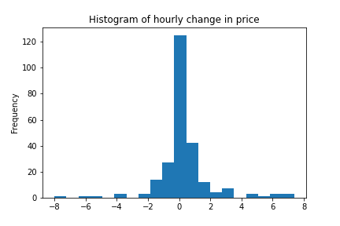
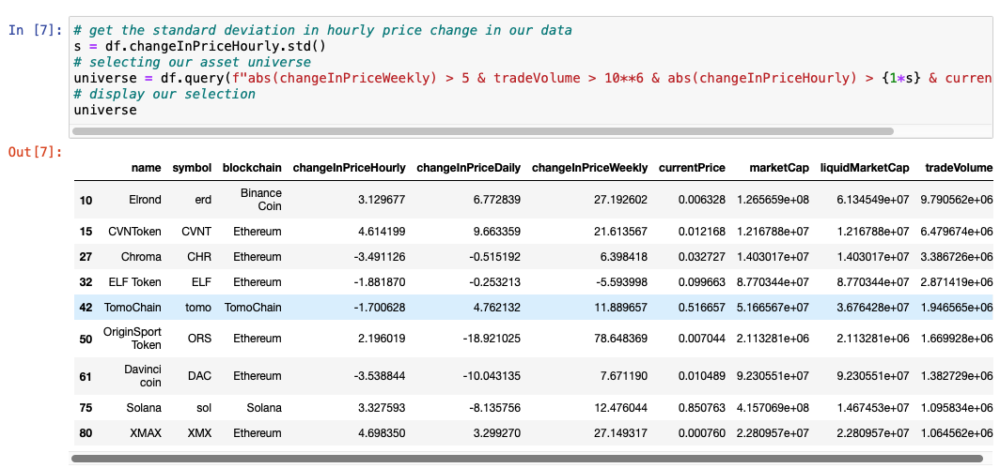
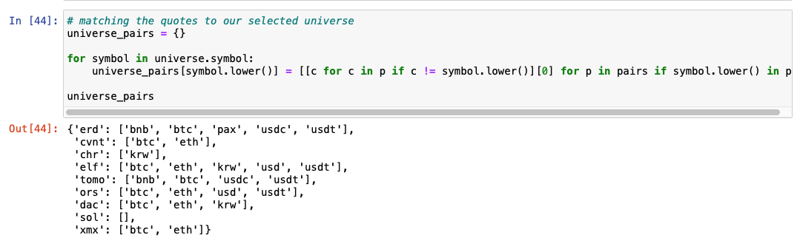
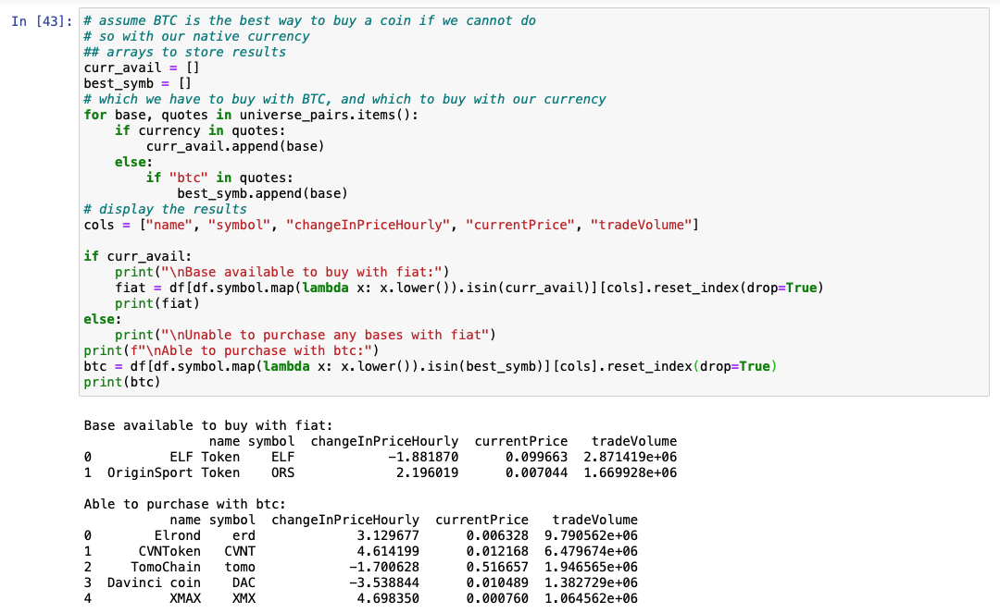

_Image courtesy of The Chandra X-Ray Observatory_ 

No matter how much math and computer science you can crank out per day, your trading strategies will not work unless you have quality data for backtesting and simulations.

Famously, Renaissance Technologies started with such a strong lead as a hedge fund by hiring top talent, namely top talent to manage their data sources. Amberdata provides institutional-grade data for people looking to trade cryptocurrencies, so let us see how we can use just the free-tier endpoints to build the scaffolding for a trading strategy.

## Introduction
One of the most important parts of day trading is identifying the right assets to deploy capital against. Choosing the right horse to ride is a critical part of assets selection. Once we identify assets that meet the criteria, then the trading muscle memory can begin. We can automate this process using only Amberdata’s free tier API’s and a bit of wrangling in Python. Be warned: automating a strategy is addicting and is known to be habit forming. Some people turn these skills into a hobby or side project for making money, which is evidenced by the Reddit community [/r/Algotrading](https://www.reddit.com/r/algotrading) that has nearly one hundred fifty thousand members as of the time of writing.

Due to the volatile nature of some crypto assets many people prefer to not hold positions overnight, so my goal in this analysis is to find assets demonstrating momentum to be traded intraday. There are many ways to do this, and your method will change based on your trading goals, but today I will focus on a very simple case which can be extended more broadly. We will go over how we can apply some key metrics to choose a universe of assets, and this method is easily mutable to other ways of selecting assets for different goals.

## Analysis
The goal for intraday traders usually starts with identifying assets showing price momentum with enough liquidity that we will be able to enter and exit without a lot of slippage. For more information on picking assets for intraday trading, Investopedia is always a great place to start.
The first endpoint I consider and the most powerful one for my purposes is Address Rankings Latest. This gives me key information about available crypto assets, and the ability to sort them based on some criteria, set by using sortType. Here are my options:

* `changeInPrice` — the weekly change in price
* `currentPrice` — the current price of the asset
* `liquidMarketCap` — the market capitalization of the asset available to the market
* `marketCap` — the total market capitalization of the asset
* [`tokenVelocity`](https://www.bitcoinmarketjournal.com/token-velocity/) — total transaction volume divided by market capitalization. This is an important metric and worth looking into, but we will not discuss it here.
* `tradeVolume` — current volume of the assets
* `transactionVolume` — average volume per transaction
* `uniqueAddresses` — the number of unique addresses or “cold wallets”

As stated above, I want to make sure I am using high volume assets, I will sort by `tradeVolume`. This is what the top 10 highest volume digital assets look like at the time of writing:

Some of the blockchain data has very high precision, up to $10^{18}$ decimal places. While this level of data precision is important for the functionality of the blockchain, I doubt it will make or break our strategy. This is easily taken care of using Pandas while we do...

## Exploratory Data Analysis
This is where we do some simple data manipulation to standardize those numbers a bit, and drop columns that we are not using in my analysis.

Since this is high-quality data, the EDA step is fairly straightforward. Now that that is out of the way, we can get to the fun part.
## Define My Universe
Now we have our crucial information to define my asset universe for trading. As stated above we care most about these two things for selecting assets:
1. Liquidity
2. Volatility

Here, I use volume as a proxy for measuring liquidity, and we can easily determine volatile assets with `changeInPrice`. For this endpoint, the highest granularity way to look at volatility is changeInPriceHourly, so my analysis will focus on that and `changeInPriceWeekly` for a bigger picture view, as well as `tradeVolume`. We also do not want a high of barrier to entry, so we will choose relatively low-value assets so we can enter a position on a budget.
We can plot the values of `changeInPriceHourly` across the data in a histogram. As a note, this is in percentage. Most of the assets have little variation, but I find some assets showing high volatility in the tails.

In order to satisfy all of our criteria for picking assets, I developed the following rules:
* Assets with `tradeVolume` > $10^6$. We want the upper tier of liquid coins for day trading. In the future we can set this more rigorously, but for now I just eyeballed this.
* Assets with `changeInPriceWeekly` < -5% or `changeInPriceWeekly` > 5% to get assets which are not usually stable.
* Assets with `changeInPriceHourly` greater than one standard deviation. We want assets towards the tail of recent volatility, not the stable ones making little movement.
* Assets with price < $15. This way we can take a larger position.

Enacting those rules on our dataset gives us this:

If you would like to try this out for yourself, the full Jupyter notebook and Python code for this post is available [here](https://github.com/amberdata/evan-blog-posts/tree/master/market-rankings). Since these are sorted by the highest volume digital assets, we could just go ahead and just pick the top one to three to trade with, but by using a couple more data sources we can do a little better.

## Preparing to Trade
With that out of the way, let us zoom out and think about how we would trade these assets. The easiest way to do so — assuming you do not currently own Bitcoin or some other cryptocurrency to trade for an asset — would be to buy it with USD. By choosing to trade coins that we can buy with USD, we can skip the middleman and some potential loss of capital in transaction fees and slippage and can go straight to trading assets.

Since we are trading currencies, we can think of the market as similar to Forex, in that you trade one currency for another in what is called a “pair”. In such a “pair”, there is a [base currency](https://www.investopedia.com/terms/b/basecurrency.asp) that we purchase — let ‘s say Ethereum or ETH — and a quote currency — say bitcoin or BTC — that we use to purchase the base.

## Back to the Basics
We can get a snapshot of which pairs are being traded on all of Amberdata’s supported exchanges with the [Price Pairs](https://docs.amberdata.io/reference#market-prices) endpoint. With some data-fu, I make this list of my bases, and their quotes.

One thing you notice is that you can purchase basically anything with bitcoin. So we can logically split my bases into two categories: ones we can buy with USD, and ones we cannot. For the time being, I assume coins can be bought with BTC if they cannot be bought with USD.

From here, we just need to decide which — typically between one to three — assets to engage with, and that requires a little bit more research as it is the last step before I would think about putting in my own money. We can use metrics such as [VWAP/TWAP](https://www.investopedia.com/terms/v/vwap.asp) to narrow down my choices further, for example, we may always want to buy below VWAP or Sell Above or scale in or out of a position using Volume Weighted Average Price (VWAP) to know we got a fair price in aggregate. Another method is to look for assets that have “popped-up” and held steady.

## Conclusion
Using just free endpoints on Amberdata, we can easily whittle down my universe of assets for intra-day cryptocurrency trading from thousands to a handful of candidates. We used the [Asset Rankings Latest](https://docs.amberdata.io/reference#market-rankings) endpoint to find assets that met our base criteria. From there, we used pairs data to separate our assets into ones we can buy with fiat vs. bitcoin. The next course of action before trading is looking up an OHLCV chart and doing technical analysis.

If you would like to unlock even more advanced tools for deciphering the market, such as real-time and historical order books data, historical OHLCV, reference rates, metrics, and more please visit [Amberdata.io](https://amberdata.io/) and stay tuned for more blog posts about the crypto asset market.

The code for this blog post is available [here](https://github.com/amberdata/evan-blog-posts/tree/master/market-rankings).

## Sources
* Base Currency — https://www.investopedia.com/terms/b/basecurrency.asp
* Rules for picking stocks for day trading — https://www.investopedia.com/day-trading/pick-stocks-intraday-trading/
* Amberdata Docs — https://docs.amberdata.io/reference
* Token Velocity — https://www.bitcoinmarketjournal.com/token-velocity/
* VWAP — https://www.investopedia.com/terms/v/vwap.asp
