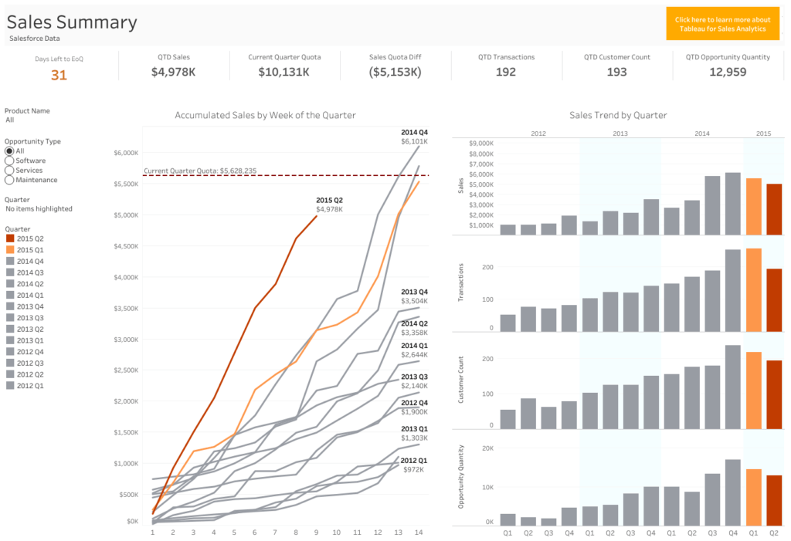
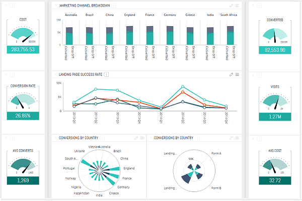
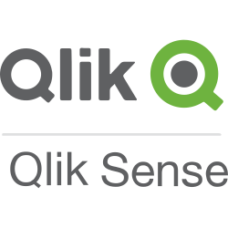
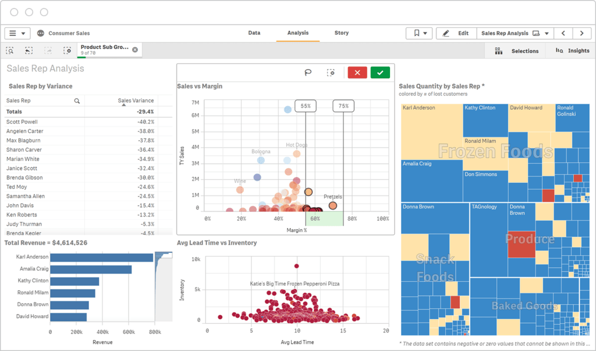

Traditionally used by larger companies with a lot of data, many companies turn to Business Intelligence tools to maintain a competitive edge. Business Intelligence data analysis tools are used for deriving useful insights from business and market data. They allow users to improve operations, to optimize business processes, and to better understand the customer lifecycle. In advanced cases, Business intelligence software also provides predictive modeling and statistical modeling to understand the future. Artificial Intelligence and Machine Learning tools can augment these valuable analytics to provide surprisingly accurate forecasts, or “predictive analytics”. 

To pick this apart a little bit, what is predictive analytics, and why does a Business Analyst have use for AI and Machine Learning when building dashboards? Let’s imagine that the business analyst has loaded all of their sales and marketing data, and would like to report what sales will look like in the upcoming quarters. Now the teams in charge of revenue can set realistic spending goals and understand how much the revenue pipeline must grow to accommodate. In this case, the data analyst is using historical data to understand something about their future to aid their business, hence the “predictive” in predictive analytics.

Over 100 Business Intelligence tools exist today, so condensing this list down to data analysis tools can be a struggle. Fortunately, we have provided a list of 3 of our top picks for data analysis tools to use within your business of any size. Each of these has its own benefits and downsides relative to the others, so we will be comparing those as well, and providing key takeaways to help identify best use cases. This is by no means an exhaustive list; it is just to give an idea of some of the more powerful and commonly used tools for this exciting new business operations function.

## 1. Tableau
[Tableau](https://www.tableau.com/) is possibly the most well-known data analysis tool and was recently bought by Salesforce for its popularity and product quality. For a medium or large-sized company looking to generate valuable dashboards for their business processes, Tableau is an excellent first choice. It provides industry-leading connectors for bringing in data from all data sources. 

Tableau offers a very intuitive drag-and-drop interface that is used to some extent by all three of the data analysis tools discussed here. It also is the only one of the three that offers predictive analytics on top of their typical visualizations and is known for its capability to share dashboards between users.

### Pros
* Plenty of flexibility with data visualizations
* Easy drag-and-drop interface
* Great guide and documentation available for new users
### Cons
* A bit pricey for small businesses. Priced at $35 for personal, or $70 for business per user per month
* Requires pre-cleaned data
* Steep initial learning curve

### Best Case
Tableau is the best overall data analysis tool but can be expensive for smaller companies. This tool is best used by enterprise-grade companies with big data and a team of dedicated data analysts who are looking to improve business practices with their large datasets.

## 2. Sisense
[Sisense](https://www.sisense.com/) is another popular data analysis tool among businesses, allowing an easier combination of diverse datasets than Tableau. They also offer high-performance capabilities such as in-memory processing for faster processing of data. The platform also enables multi-user access on dashboards, which could benefit larger projects with multiple data analysts working on the same dashboards.

Sisense’s real strength lies in its ease of use to incorporate complex data and its automated import features. Sisense also recently acquired Periscope data, which allows BI users to do much more compelling and in-depth digging through their data than would previously be possible without advanced SQL skills.

### Pros
* Very fast cloud platform
* Easy to connect with other data sources such as Hive, Salesforce, and more
* Interactive BI reporting
### Cons
* Pricey for small businesses
* More difficult to share dashboards
* Slight initial learning curve
### Best Case
Sisense is best for medium to large businesses looking for a BI platform that can easily combine their diverse array of data types, and develop large projects quickly and efficiently. Sisense has some of the most power under the hood of these three, and they have compelling customer service if you ever run into difficulty using their platform.  Their pricing is not shared online.

## 3. Qlik Sense
[Qlik Sense](https://www.qlik.com/us/products/qlik-sense) is a data analysis tool best used for small or medium-sized businesses looking to get a fast, robust BI platform with a limited budget. It eliminates the need for SQL queries with its smart data load feature, but for full access to its cloud data warehouse, you need to upgrade to the full version.

Qlik Sense incorporates a lot of the best features of the other products, such as a drag-and-drop interface, visualization flexibility, and automated data loading, at the lowest price point of the three.

### Pros
* Cheapest option at free for Qlik View Personal, or $30-$70 per user per month for business users
* Automated data loading – no SQL skills necessary
* Excellent data visualization capabilities
### Cons
* Can be slow with large datasets
* Not as many data connectors as Tableau or Sisense
* Some limitations in custom graphics
### Best Case
Qlik Sense is the best data analysis tool for smaller sized businesses with compatible data sources looking to get BI software up and running for free. This is a robust platform with great visualization capabilities and plenty of online documentation, so for most small or medium-sized businesses, they are worth checking out for the value.

## What’s the Best Data Analysis Tool?
In conclusion, companies of all sizes are now looking to take advantage of their data sources by employing a data analysis tool. Over 100 different business intelligence software offerings exist, so we have condensed the list here to three to help users choose the best one for their use case.

Of the three, Tableau is the industry leader with the most connections, built-in data safety, and advanced tools such as predictive analytics and forecasting. Sisense is an enhanced version, for teams with more advanced data who are looking to build large dashboard projects efficiently. Qlik is the budget option, which still retains many of the important features and a robust platform to boot.  The next phase in data analysis is predictive analytics, which is concerned with estimating future outcomes with past data, statistical analysis, and machine learning. But don’t be discouraged, you can use Ople to do predictive analytics on [the Ople Platform](https://ople.ai/product/) itself or [integrate into Tableau](https://ople.ai/tableau-integration/) or other BI tools.

Ople allows data analysts and business analysts to leverage the same power of machine learning as their counterparts on the data science team, enabling the business analyst to utilize advanced machine learning methods such as data cleaning, feature engineering, and modeling techniques to bring the best in prediction and forecasting to their data. With Ople, it’s never been easier to build, interpret, and launch production-ready machine learning models. Contact us today to get started!