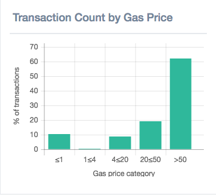
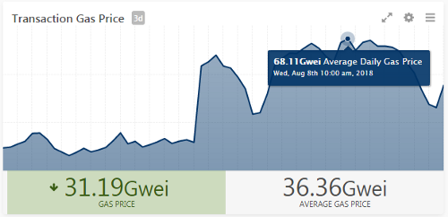
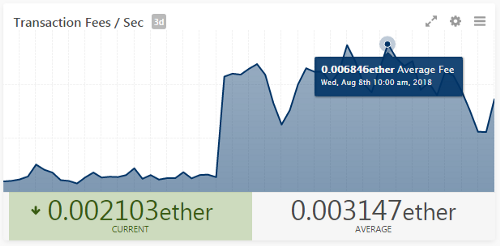

_Ethereum has shown some weird behavior recently, and it’s time for a checkup._

This past week the gas price, or price of performing computation on the Ethereum network, has risen. The Ethereum blockchain employs [smart contracts](https://ethereum.org/en/developers/docs/smart-contracts/) executed by miners to complete tasks on the network. These have a bevy of benefits including accountability and accuracy to all users, as well as a certain cost of completion to compensate the miner for their time and computational resources called gas.

As we can see from this screenshot taken earlier this week, the proportion of high gas price transactions is at a high. We covered this behavior in my previous [post](/2018/08/tracking-tuesdays-ethereum-network-overload/), and now this is believed to be a result of a [lottery-esq Ponzi scheme](https://cryptovest.com/amp/news/cloned-fomo3d-game-most-probable-reason-for-ethereum-congestion/) with a jackpot nearing 22,000 Ether, worth roughly $7.8 Million currently. For reference, this would have been be worth almost $30 Million at the peak price of Ethereum early January.

## The Stats
Originally thought to be a spam attack, this was ruled to be improbable due to the prohibitive cost of performing such an attack on the network. We went into a fire drill to diagnose this activity, and were able to come up with some pretty telling symptoms of this on-going lottery:

These graphs show the average daily gas price and average transaction fee before and after the activity began. Our statistics indicate that the average gas price more than doubled from 14 to 35 Gewi at the time of measurement. We found that contracts executed on the main channel became more expensive, from an average gas used of 57,349 average in the week prior to 72,769, indicating a new widespread and expensive activity on the network.

Furthermore, most of the activity with the account is outgoing to Externally Owned Accounts, or EOA. 234,600 transactions are found outgoing to 5,800 unique addresses with an average transfer of 0.09 Ether, on a total Ether transferred of 21,100 ETH. Incoming from EOA’s are 125,200 transactions from 36,700 unique addresses with an average transfer of 0.38 Ether — presumably the cost to “play” — totaling to 48.5k Ether transferred to the address.

In conclusion, there is significant evidence to suggest strange or unintended activity on the Ethereum network. This activity is likely a winner-takes-all lottery and is taking the lions share of high value transactions.

At [Amberdata.io](https://amberdata.io/), we report the latest in blockchain health and provide key metrics for tracking usage on the Ethereum network.