Part of building a profitable trading strategy is quickly testing novel ideas. These tend to be the money makers in the rare case that they prove useful once you can integrate them into your strategy.

Today, we will investigate one such idea. Here is the context: currently BitMEX — a large exchange for trading Bitcoin — allows withdraws from their wallets only one time per day. 

These withdraws — or outflows — can be quite high volume, so we would like to know if these so-called outflows of Bitcoin from BitMEX wallets are possibly an indicator of the Bitcoin market. Since I work for Amberdata, and Amberdata provides the best blockchain metrics and data, we will be using their product for today's analysis. All we need for this analysis is Amberdata’s Pro API and Python3 installed, so let us get started!

## What is Inflow/Outflow?
Here we are looking at large movements of Bitcoin into and out of BitMEX wallets. More specifically, when somebody deposits money into, or makes a withdrawal from their BitMEX wallet; however, we do not have access to the Exchange’s data when users are depositing money, so we infer the flow of money into the wallets by watching their account balances on the blockchain. Simply put, inflow increases an address’ balance, while outflow decreases the address’ balance. 
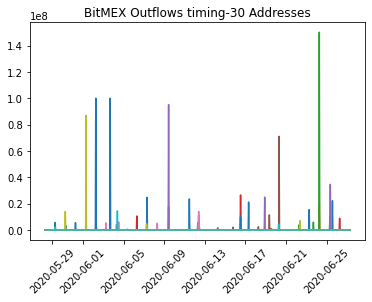

Just as a quick sanity check, I decided to look at the hourly account balances of a few recently active BitMEX BTC wallets. As expected, the wallet outflows line up to only once per day. Note: the value on the y-axis is in Shatoshi’s, not Bitcoin. We can also test this assumption directly with the code below. It groups the data from hourly to daily, and tests to see if there is more than one outflow per address per day. Testing this on our above data shows the assumption is safe for now. The full notebook for this analysis is available [here](https://github.com/amberdata/evan-blog-posts/blob/master/bitmex-inflow-outflow/notebooks/1.0-ea-analysis.ipynb).

```python
combined = pd.DataFrame(data).T
combined.columns = [str(i) for i in range(N)]
combined = combined.applymap(lambda x: 1 if x > 0 else 0)
combined = combined.reset_index().rename({"index": "ts"}, axis=1)
combined['date'] = combined["ts"].apply(lambda df: datetime.datetime(year=df.year, month=df.month, day=df.day)) 
combined.set_index(combined["date"],inplace=True)
combined = combined.drop(["date", "ts"], axis=1)
combined = combined.resample('D').sum()
if combined.max(axis=1).max() == 1:
    print("Our assumtion is safe.")
else:
    print("Incorrect assumption!")
```

As we view the account balances of all addresses associated with BitMEX, we can start to get a picture of the net inflow/outflow of the exchange. Let us talk a little bit about the rationale behind our calculations.

## The Calculation
Our primary interest is the money going in and coming out of BitMEX wallets, so let us talk a bit about how we calculate this. Imagine we have an eagle-eye view of the account balances on every BitMEX address. When one of the addresses, let’s call them A, makes a trade with another BitMEX address, B, for $100 worth of Bitcoin, then the transaction looks as such:

$ A \rightarrow{} 100 \rightarrow{} B$

In other words, address A has an outflow of $100, and address B has an inflow of $\$$100. 

But, we are most interested in the flow of money in and out of the system: the BitMEX exchange. Hence, we take a look at the net flow of all addresses. We calculate the net flow as:

$Net = In - Out$

In this view, we can compare the total money going into BitMEX Bitcoin wallets, and the total money going out. When there is a large move in either direction, this will show up on the net inflows/outflows.

## The Analysis
Now that we have the calculation down, it is time to turn our attention to getting the data. As mentioned above, we are focusing in to BitMEX Bitcoin wallets, and since we want to capture as much activity as we can, we extend the look-back to one year from the current day. We collected as many addresses as we could for this analysis, approximately five hundred thousand in total. These addresses all start with either “3BMEX” or “3BitMEX”, and in our analysis “3BMEX” was much more common. In our case, the average activity addresses did not differ much between the two naming conventions.
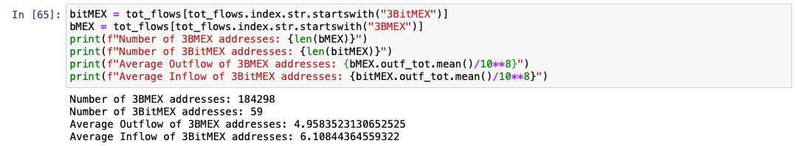

Once you have your addresses — and these could be any set of addresses on supported blockchains — you can use this great little function to get the response from Amberdata:
```python
def get_response(url, headers=None, queryString=None):
    "Get the REST response from the specified URL"
    if not headers:
        headers = {'x-api-key': api_key}
    if queryString:
        response = requests.request("GET", url, headers=headers, params=queryString)
    else:
        response = requests.request("GET", url, headers=headers)
    response = json.loads(response.text)
    try:
        if response["title"] == "OK":
            return response["payload"]
    except KeyError:
        return None
```
This works for all of the calls in the analysis, but using `response["payload"]` may not be ideal for your use-case, depending on the endpoint. In this case we are accessing Amberdata’s [Account Balance Historical](https://docs.amberdata.io/reference?ref=hackernoon.com#get-historical-account-balances) endpoint, which looks a little like this:
```python
url = "https://web3api.io/api/v2/addresses/" + address + "/account-balances/historical"

querystring = {"startDate": startTime, "endDate": endTime}

headers = {
    'x-amberdata-blockchain-id': "bitcoin-mainnet",
    'x-api-key': os.getenv("AMBERDATA_API_KEY")
}

payload = get_response(url, headers, querystring)
```
Where address is the address for which to get account balance. Our focus is on addresses on Bitcoin, so we use `bitcoin-mainnet` for the blockchain ID. 

At five hundred thousand addresses over a year-long period, this computation can take upwards of 40 hours! This is where Python’s built-in support for concurrency comes in handy. Using a function called `daily_inflow_outflow` in `utils.py` to calculate the daily total inflow and outflow for an address, we can use Python’s `ThreadPoolExecutor` to cut the execution time by 5x or more — depending on the speed of your machine. We save the aggregated daily flows as well as add them to the `gross_daily` data frame. After running my analysis, the size of `all_activity` was over 6 GB! This we can use later for digging deeper into the activity.
```python
for i in tqdm.trange(len(addresses) // config.P):
        with ThreadPoolExecutor(max_workers=4) as executor:
            futures = {executor.submit(utils.daily_inflow_outflow, addresses[config.P*i+j], headers, querystring): addresses[config.P*i+j] for j in range(config.P) if i+j < len(addresses)}
            for future in as_completed(futures):
                address = futures[future]
                res = future.result()
                if res is not None:
                    gross_daily += res
                    all_activity[address] = res.to_json()
                else:
                    all_activity[address] = {}
```
We use some vectorized functions in Pandas to add together all of the inflows and outflows of these wallets, overlay the net with the price of bitcoin, and voila! 
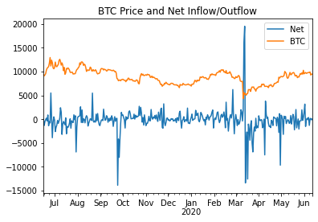

First, note the obvious spikes in inflow/outflow. We might categorize these as anomalous behavior. These are the signals that we wish to evaluate in our strategy. We first difference the net flows, or — in time series terminology — introduce a lag of one. Simply put, we calculate the daily change in net flow. By plotting the lagged daily net flows on a histogram, we can get an idea of the distribution of daily change in net flow and can infer anomalies.
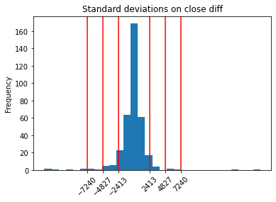

Here, we are looking specifically for the outliers, so we plotted standard deviations from the mean by red lines. We choose the outer red line to indicate high changes in net flows. In plain English, if we observe a daily change in net inflow or outflow greater than 3 sigma, then it is a significant amount of flow out of or into BitMEX wallets. If we choose 3 standard deviations, we end up excluding 97.521% of the days from our analysis. Some sharp-eyed statisticians may notice that 97.521% is not the 99.7% we would expect from 3 sigma. Since this is just an empirical estimation based on historical values and our daily change in net flows do not look normally distributed, we cannot expect to see exact quantiles.

Now that we can identify abnormally high net flow days, we can plot our days of high inflow/outflow over the price of Bitcoin.
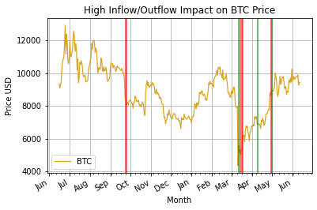

Here we can see that high BitMEX outflow is typically accompanied by a sharp downturn in price. The event in October 2019, March 2020, and late May 2020 were all followed by huge outflows of Bitcoin in BitMEX wallets. We can drill down into these periods further and see what was going on.
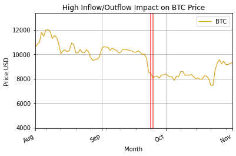
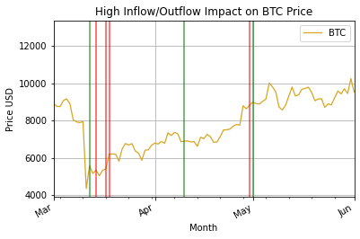

But, notice that it takes the current algorithm a day to recognize the change in flows. By that time it is likely already too late, so we can do better with a rolling standard deviation SMA, or [Bollinger Bands](https://www.investopedia.com/terms/b/bollingerbands.asp). These will help us quickly identify when we are experiencing sufficiently larger flows than usual in either direction. Using slightly modified code from a Python website for [Bollinger Bands](https://ad1m.github.io/derivative/bollinger_bands.html?ref=hackernoon.com):
```python
def bollinger_bands(df,lookback,std,plot='no'):
    sym = list(df.columns.values)[0]
    rolling_mean = df.rolling(window=lookback,center=False).mean()
    rolling_std = df.rolling(window=lookback,center=False).std()
    upper_band = rolling_mean + std*rolling_std
    lower_band = rolling_mean - std*rolling_std
    lower_band.rename(columns={sym:'lower band'}, inplace=True)
    upper_band.rename(columns={sym:'upper band'}, inplace=True)
    rolling_mean.rename(columns={sym:'SMA'}, inplace=True)
if plot == 'yes':
        ax = df.plot(title="Net Flow BB", label=sym,color = 'blue')
        rolling_mean.plot(ax=ax, color='gold')
        upper_band.plot(ax=ax, color = 'cyan')
        lower_band.plot(ax=ax, color = 'cyan')
        ax.set_xlabel("Date")
        ax.set_ylabel("Price")
        ax.legend(loc='upper left', prop={'size':8})
        plt.savefig(sym+'_BollingerBands.png')
        plt.show()
    return rolling_mean,upper_band,lower_band
rolling_mean, upper, lower = bollinger_bands(data[["net"]], lookback=60, std=3, plot="yes")
```

Gives us this sort of painful looking graph:
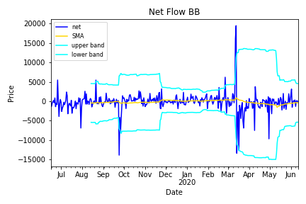

Where the cyan lines are the Bollinger Bands. When our series passes above or below those bands, it is a signal of anomalous behavior. Now we see just how much quicker we are at identifying large flows. The results differ drastically depending on the look-back window and and choice of sigma, so I encourage you to try that on your own. Plotting the days that exceed the Bollinger bands, we find a much tighter fit with price movements:
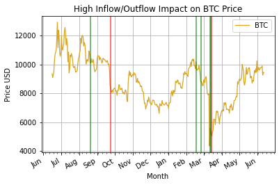

Zooming in to the two periods of high flows:
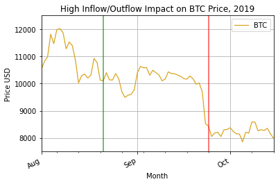
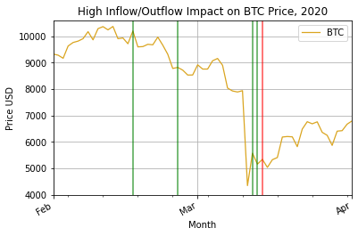

We see that we have a lagging indicator and more false positives than we had in the previous method. False positives are a common downfall of Bollinger Bands, and they are usually paired with another indicator for this reason. Fortunately, we have a very clear picture of the highest activity period in mid March 2020. People rushed in after a drop of over 37.5% and bought as much as they could for two days, and many people also left on the third day after the drop. In the first period, we can see everybody selling after a drop of roughly 20%. Another great lesson to just HODL and keep moving forward.

Now, let us just have fun and look at the largest flows over the period. These are all of the flows greater than three standard deviations from normal values:
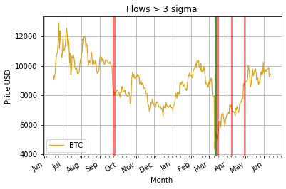

Zooming in for more context:


This method is equivalent to drawing a horizontal line above and below the net flows and marking all days with net inflow above and net outflow below the line as anomalies. While the most direct way to view the activity we describe, here we are also the most prone to [data snooping bias](https://www.quantshare.com/sa-59-data-snooping-bias?ref=hackernoon.com). Clearly, these outflow activities happen around the largest periods of price movements. However, since we cannot know the average standard deviations of net flow in advance we cannot say for sure that this sort of analysis is even possible. The only feasible way of running this live would be to use Bollinger Bands with a look-back window of 365 days, but we do not have enough data here to back-test it.

One drawback of this analysis is that we observe only daily flows. As we know, Bitcoin is traded live at all times of the day and night across the world, so it is to our detriment to split the prices by day. An interesting way to move this research further would be to drill down into the periods of high inflow/outflow and do an hourly or minute-by-minute analysis, and see how quickly we get the signal and can act on it.

In order to implement this concept in a live strategy, we can take advantage of Amberdata’s [Addresses Balance Batch](https://docs.amberdata.io/reference?ref=hackernoon.com#address-balances-batch) endpoint to monitor the live inflow and outflow of BitMEX wallets. When the outflows reach a certain threshold, we have an indication that a large market movement will precipitate. 

The full code for this post is available [here](https://github.com/amberdata/evan-blog-posts/tree/master/bitmex-inflow-outflow?ref=hackernoon.com).