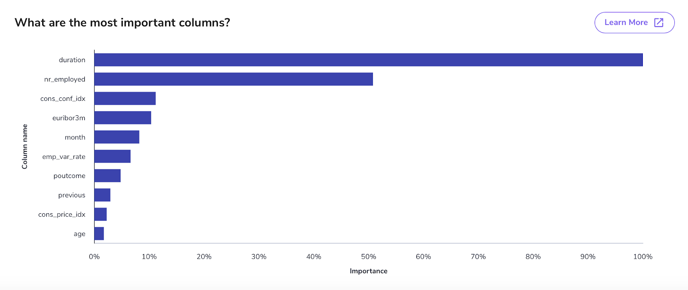

Machine Learning is not only mysterious for business analysts that do not understand it, but for the practitioners like data scientists and machine learning engineers as well. In Machine Learning, there is a tradeoff between model complexity and interpretability. In other words, the most complex, predictive, and adaptable machine learning models are often the least interpretable. Interpretable here means comprehending the influencing factors of the decisions created by this complex machine learning model. We call this problem the “Black Box” problem of machine learning.

This lack of transparency can be dangerous because people can deceive even the best deep learning models in often [unexplainable ways](http://www.evolvingai.org/fooling). In our case, model transparency and explainability refer to the ability to observe the processes that lead to decision making within the model. Transparency solves this problem by using easily interpretable models, some of which we will touch on in the next section. Explainability solves this problem by “unpacking the Black Box”, or attempting to gain insight from the machine learning model, often by using statistical methods. Overall, these two methods are often combined to create Explainable AI, or XAI for short. 

In this article, we will discuss the importance of model transparency and explainability, how to interpret, or why you cannot interpret, your machine learning model, and finally touch on some modern solutions to unpack the Black Box. 

## What is Explainable AI?
Explainable AI is machine learning that has the property of being easily understood by humans. As explained above, model transparency and explainability are two different approaches to achieve explainable AI. The significance of XAI lies in the fact that machine learning models create rules based on data, and with Explainable AI, we can understand the rules the model discovers in the data.

AI brings value when it works well – such as understanding your customer base better or reducing work needed to complete some task, but it can also bring even more value when we understand why it works. Examples of where XAI brings value include: when a transaction is fraudulent so we can identify evidence of fraudulent activity, how much longer an engine can run before it will need to be replaced so we know which part is failing or causing the failure, or which news articles are similar to each other and how positive or negative they are so we can quickly and clearly identify characteristics of these documents. For some more critical machine learning models, such as classifying a tumor to be benign or malignant, XAI is a critical element because doctors may want significant evidence to support the result before prescribing treatment. 

The goal of model transparency and explainability is to provide the user with the factors that lead to the model’s prediction. For example, an explainable machine learning model trained to classify song genres would identify a particular song as thrash metal for example, because of high tempo, loud and fast drumming patterns, and distorted guitars with certain rhythmic characteristics. This output is a lot more useful in understanding the problem than a model that reports the song to be classified as thrash metal with a probability of seventy-five percent, for example. In the next section, we will talk about the transparency of popular machine learning methods.

## Model Explainability in Machine Learning
### Linear Models
As stated before, simpler models tend to be more transparent and thus inherently more interpretable. The strongest machine learning model in terms of model transparency are linear models. A simple linear model to predict home price as a factor of square footage and age might be: 

$homePrice = 150,000 + 0.4\*ft^2 – 0.74\*age$. 

We interpret this model as saying that for each square foot in the property, the home price increases by 0.4, and for each extra year since the house was built, the home price decreases by 0.74.

### Random Forests
Another machine learning algorithm – popular for its relative ease of use and broad predictive power – is Random Forests. As ensembles of decision trees, these models have two forms of transparency: feature importance and prediction results. 

Feature importances give the high level most valuable variables for the model’s rules. If we trained a random forest model to predict home price, it might show that the square feet feature is more important than age, even though they both affect the outcome of the model. 

These models used to be considered less interpretable because they often struggle to show how each variable affects the prediction. However, a recent development called feature contribution computation gives similar output to the linear model for a given prediction for greater model transparency and explainability. You can read more about how this is implemented in scikit-learn [here](http://blog.datadive.net/random-forest-interpretation-with-scikit-learn/).

### Deep Neural Networks
Finally, Deep Neural Networks (DNNs) are often considered the least explainable popular model. DNNs consist of many layers of nodes controlled by non-linear activation functions to produce an output from a given set of inputs. As discussed by Ople’s founder and CEO Pedro Alves in this [panel discussion](https://ople.ai/ai-blog/panel-discussion-deep-learning-where-do-we-go-from-here/), a seemingly accurate deep learning model can be unknowingly using features that are not at all relevant to the problem you are trying to solve.

But, let’s now imagine that we want to combine the predictive power of multiple models – which is totally common practice and is called ensembling – to create a larger more robust model. In the next section, we will discuss a couple of methods of bringing model explainability to any machine learning model or models you choose.

## Unpacking the Black Box
Certain statistical methods exist to gain insight into the “black box” of any machine learning model. The most common one is called LIME – short for Local Interpretable Model-Agnostic Explanations. LIME essentially runs the model in a parameter space close to the prediction to understand how each feature impacted the results of the model. To understand this, let’s look at the result for our previous example. Let’s say that we use a more complex, less transparent version of our home price model for a 15-year-old, 1000 square foot home and predict a home price of \$300,000. The LIME method would ask the model what it thought about a 15-year-old, 900 sq ft home, and a 14-year-old 1000 $ft^2$ home, and so on. After testing around the prediction’s parameter space, LIME comes back with the transparent result: $home_price = 150,000 base + 200,000 textrm{from }ft_2 – 50,000 textrm{from age}$.

Other methods exist to improve model explainability from a given machine learning model, and if you are interested I suggest you check [here](https://christophm.github.io/interpretable-ml-book/) as it is a great resource on the topic and covers much more than we could here.

## Wrap-Up
In conclusion, model transparency and explainability are two approaches to building explainable AI, which provide more value than their black box counterparts due to their interpretability. We discussed the transparency approach – choosing models that provide insight into the decisions behind the rules it creates, such as in linear models, and the explainability approach – inferring the learned patterns from any model after it has been built, such as in LIME.

At [Ople](https://ople.ai/), we understand the value of explainable AI, and have baked in model transparency and explainability with the Simulate tab so you can better understand the model’s predictions. Contact us today to start your free trial!

## Sources
* Panel on Deep Learning: https://ople.ai/ai-blog/panel-discussion-deep-learning-where-do-we-go-from-here/ 
* On Explainable AI: https://www.persistent.com/blogs/thoughts-on-transparency-and-explainability-of-ai 
* A History on Machine Learning Model Explainability: https://medium.com/@Zelros/a-brief-history-of-machine-learning-models-explainability-f1c3301be9dc 
* An overview of model explainability in modern machine learning: https://towardsdatascience.com/an-overview-of-model-explainability-in-modern-machine-learning-fc0f22c8c29a 
### Extra sources for Transparency in Deep Learning:
* Looking inside neural nets: https://ml4a.github.io/ml4a/looking_inside_neural_nets/ 
* Understanding neural networks through deep visualization: http://yosinski.com/deepvis