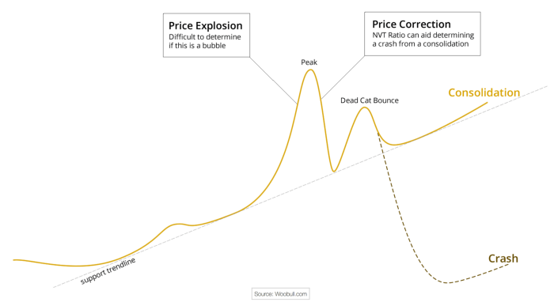
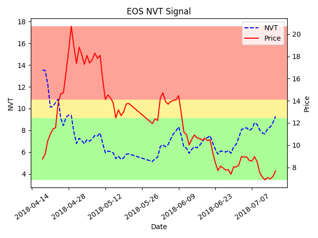

Photo by <a href="https://unsplash.com/@techdailyca?utm_source=unsplash&utm_medium=referral&utm_content=creditCopyText">Tech Daily</a> on <a href="https://unsplash.com/s/photos/ethereum?utm_source=unsplash&utm_medium=referral&utm_content=creditCopyText">Unsplash</a>
  
Following the epic ballooning of Cryptocurrency prices in December 2017, one might wonder: “How could it be possible that Ethereum was worth \$1,400 mid-December , when it is currently valued at \$472 mid-July? Is this healthy?” The million dollar question: “Were we duped?” Let’s look to the NVT — or Network Value to Transactions ratio — a useful metric for judging the effects of a bonafide Crypto “bubble”.

## What is NVT?
The NVT is an analog to the P/E ratio tailored for Cryptocurrency assets. [Introduced](https://woobull.com/introducing-nvt-ratio-bitcoins-pe-ratio-use-it-to-detect-bubbles/) by Willy Woo, the NVT ratio mimics the behavior of the P/E ratio in that we see a spike in either metric when the asset is valued much higher than its market usage.

For the uninitiated in financial math metrics, the P/E (Price/Earnings) ratio is simply given by: P/E ratio = Market Value per share/Earnings per share. A large P/E ratio indicates either high growth, or market overvaluation.

Let that sink in a bit, because it is a key concept. If the market value of TWTR is $45, and their reported earnings per share are $9, then what is P/E? The P/E ratio is 5, or in English, an owner of 1 share of Twitter Inc. would expect to see $1 of earnings for every $5 she paid in stock. If a company reports low earnings on a period of high market valuation the P/E ratio will be very high, indicating the company is either growing to provide more value, or simply overvalued on the market.

However, Cryptocurrencies operate under distributed ledger, and thus do _not_ report earnings. This is the ratio proposed by Willy Woo designed to serve the same purpose as the P/E: NVT = Market Cap/Transactions Volume. “Market Cap” is the total value of the asset. The [market cap](https://coinmarketcap.com/currencies/ethereum/) of Ethereum as of July 17, 2018 is $50.6 Billion USD. “Transactions Volume” is the value of the asset transferred in a 24 hour period, currently $2,019,510,000 USD. This gives an NVT ratio = 20.1, well below what we would consider “overvalued”.

In Woo’s formulation of this metric, he calculates this value as a 28 day moving average — 14 days behind and 14 days ahead of the current day — to more accurately depict the circumstances around a given day, and to smooth out the graph of the NVT ratio for readability.

## How to Use the NVT Ratio
The NVT ratio is an effective method of determining the behavior of a bubble after it “bursts”. After the bubble bursts, we can identify whether the bubble will be followed by one of two outcomes by looking to the NVT ratio:
* Crash — The bubble is destructive and the price crashes well below to where it was previously stable
* Consolidation — The asset retains some value after the bubble and continues towards market evaluation

If the NVT remains in the “safe” area in the post-bubble market, then this indicates we are headed towards consolidation. If the NVT continues to spike, then it is likely to crash. Let’s look at an example below of a small bubble on the EOS token.

This is a graph I quickly whipped up in Python showing the NVT signal using data from the EOS token for the past three months. We’ll go over what the signal does in the next part, but for now notice that this graph illustrates the “consolidation” behavior we discussed earlier. Notice the spike in NVT at the start of the graph. Following this spike the price of EOS token rises, yet the NVT value falls. In other words, the rise in volume outpaced the increase in value during this time. 

What we also see is the behavior discussed above: the “peak” followed by the “dead cat bounce”, and a consolidation predicted by the small NVT value during the spike. The consolation is towards a smaller value for EOS token, rather than an upward trend, but it is roughly linear and controlled and thus a consolidation, not a crash. With this information, we can expect that the token will continue to make adjustments to approach a fair market value. Now, let’s look at a variant of the NVT ratio designed to be more responsive and descriptive, the NVT signal.

## Improving Response — NVT Signal
A critic of the NVT ratio notes while it is descriptive of the local time, it’s 28 day window also prevents it from describing current time. A derivative of the NVT ratio, the [NVT signal](https://medium.com/cryptolab/https-medium-com-kalichkin-rethinking-nvt-ratio-2cf810df0ab0), is a more current and responsive version of the NVT ratio. As described in the blog post below, it is calculated as NVT Signal = Market Cap/90 MA(Volume Transmitted). Here 90 MA indicates the 90 day moving average of the transaction volume. The rational being:
* Looking 90 days in the past allows us to create a figure for today, and
* Transaction volume is our metric for utility of the asset, so we look for its medium to long term behavior.

Both of these metrics are young — at most a year old. At [Amberdata](https://amberdata.io/) we are very excited to implement these metrics into our platform and begin equipping users with valuable insight into the market behavior of their Crypto-assets. Check back soon for more info about other tools on the horizon such as ROI, volatility, and more.