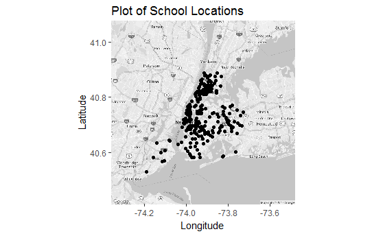
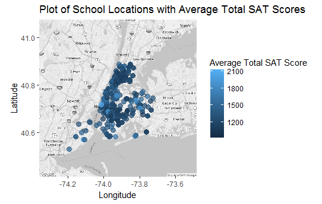
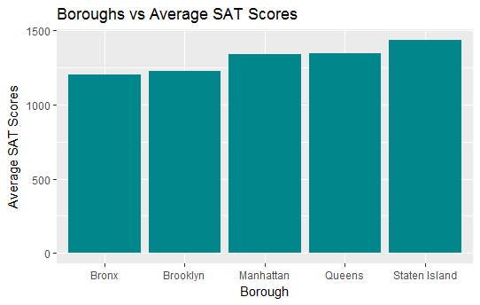
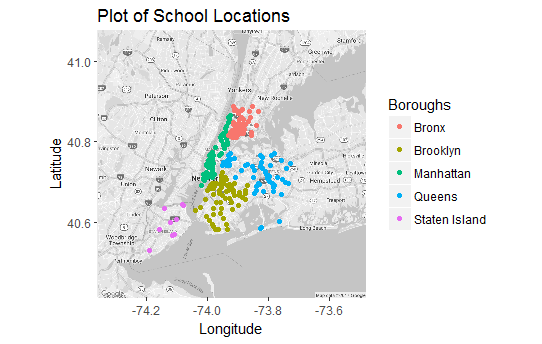

# NYC_SAT_DataVisualization_R

## Contributors
* Shon Inouye
* Elliot Villalpando
* Tiffany Cheng
* Evan Azevedo

## Abstract
We present data visualization for SAT scores of accredited high schools in New York City for the 2014-2015 school year. We used a dataset from [Kaggle](https://www.kaggle.com/nycopendata/high-schools). The analysis is done in R.

## Visualizations

