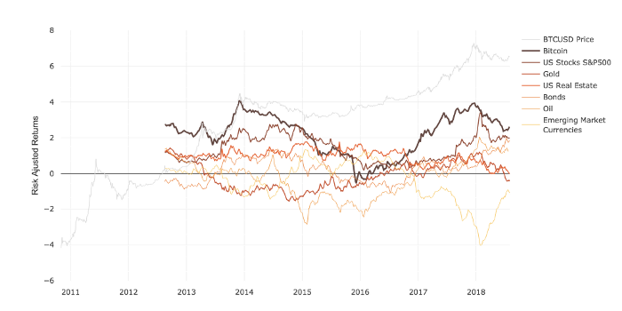
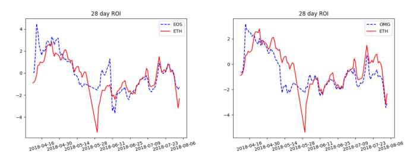

Photo by <a href="https://unsplash.com/@markusspiske?utm_source=unsplash&utm_medium=referral&utm_content=creditCopyText">Markus Spiske</a> on <a href="https://unsplash.com/s/photos/investment?utm_source=unsplash&utm_medium=referral&utm_content=creditCopyText">Unsplash</a>
  
To financially literate people, ROI needs little introduction, and to others it is likely still familiar. Let’s talk a little bit about this popular financial metric relates to the new blood on the market: Crypto assets. For a given asset, Return On Investment — or ROI — is a measure of how well an asset is expected to perform. When we discuss returns, we must also take into account the risk associated with the asset, or the Risk Adjusted Return. Simply, if two assets have the same returns, then the asset with a lower risk will have a higher [risk adjusted return](https://www.investopedia.com/terms/r/riskadjustedreturn.asp).

Something that may be surprising to readers of this post is that the ROI of Ethereum and other blockchain tokens is not unlike the ROI of the US Stock Market. As mentioned in last week’s blog post on the [NVT Ratio](/2018/07/nvt-bursting-the-blockchain-bubble/), [Amberdata](https://amberdata.io/) is excited to announce that we are incorporating these metrics into our platform.

Now let’s talk a little bit about how we use ROI in the context of Cryptocurrency assets.

## What is ROI?
ROI is typically calculated using the Sharpe Ratio. This employs a concept that the return of an asset is the difference in price from when you buy it to when you sell it. From here, the differential return is defined as $D = R_A — R_B$ for return on assets A and B, $R_A$ and $R_B$, respectively. The Sharpe ratio is simply $\textrm{Sharpe Ratio} = D/\sigma_{D}$, where $\sigma_D$ is the variance of the differential return D. For those familiar with statistics, this may bring back memories of the [t-distribution](https://www.scribbr.com/statistics/t-distribution/). This formulate gives us the “Risk Adjusted Return” of asset A relative to asset B. [Here](https://web.stanford.edu/~wfsharpe/art/sr/SR.htm#fn1) is a resource on the Sharpe Ratio written by William Sharpe himself for those more interested in this statistic.

There are two distinct and easily interpretable outcomes of the ROI metric. If...

* The ROI is negative, then the asset of interest A is a lower return investment then the alternative asset B.
* The ROI is positive, then asset A has a better risk adjusted return than the alternative B.

Common assets used for comparison are indexes such as the S&P 500, or the NASDAQ. However, the Sharpe Ratio in the case of Crypto assets benefits from a more neutral alternative asset: keeping your money under the mattress, i.e. $R_B = 0$. Here’s the argument why: we don’t want the performance of the US stock market to obscure the performance of the crypto asset. Crypto currencies provide utility outside of investment. Because we care more about risk than returns, we want to know how much riskier Ethereum is than keeping our pennies in a piggy bank.

## ROI and the State of Crypto Assets
Besides what we’ve already mentioned, what are some other insights an investor looking into Crypto assets might gain from ROI? ROI allows us to compare multiple assets, and now we can compare the risk adjusted returns of Crypto assets to the US market.

As we can see from the chart above, Bitcoin currently has better two year risk adjusted returns than the S&P 500, and the US Real Estate market, Oil, Gold, etc. Also, it has only dipped below zero _twice_ over the history of Bitcoin for a total time of roughly 3 months below zero returns.

Now let’s take a look at some home grown graphs highlighting the behavior of tokens on the Ethereum network. These graphs are the 28 day moving average of risk adjusted returns over four months of EOS and OMG tokens, plotted with ETH for comparison. We are very excited to announce that soon our website portfolio view can easily inform you if either the tokens in your wallet are beginning to produce zero returns, or are outperforming the US Stock Market.

Thanks for reading. Keep an eye out for future updates at our company blog.