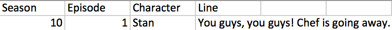
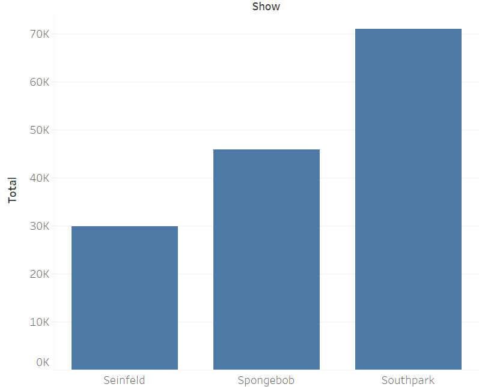
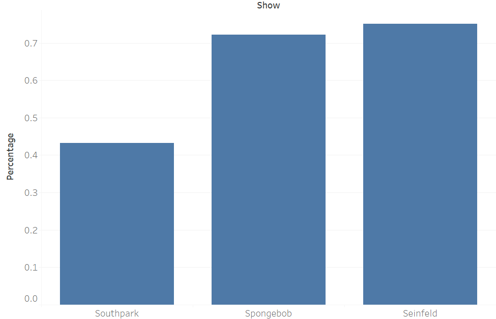
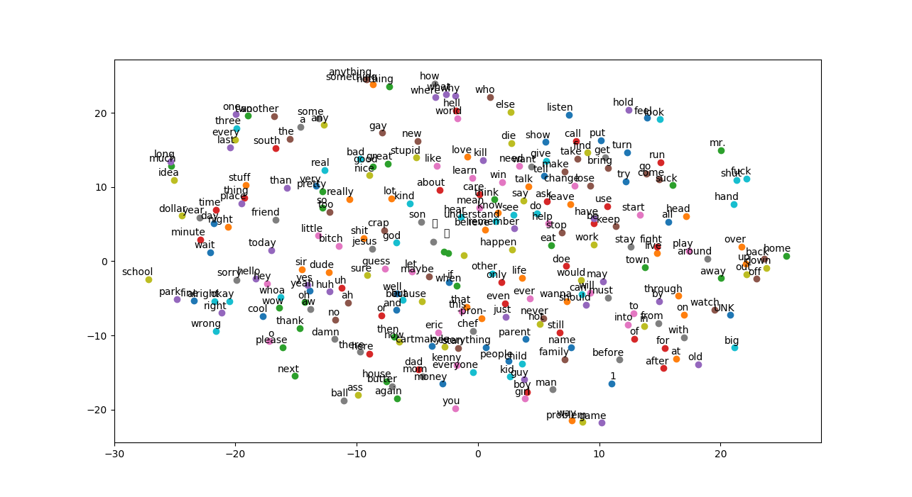

# INTERACTIVE APP COMING SOON!

This project was originally presented at the Data Science at UCSB 2018 Project Showcase. The original presentation for the project is [here](https://docs.google.com/presentation/d/1tm_tGSa-2cQLT_X32dEF-ixEbu37GI1b3ztElJZmI3I/edit?usp=sharing), and the Github page is [here](https://github.com/JayDSingh/SpongeGuyParkFeld). Check out Data Science at UCSB [here](http://datascienceucsb.org/).

## Abstract
We clean and analyze online transcripts of several popular American sitcoms (Family Guy, South Park, Seinfeld, Spongebob) and present our findings.
We find these to be suitable datasets to perform typical NLP tasks, such as Word2Vec and line classification.
The desired outcome of this project is a text generator which will be able to create new content based on the styles of these individual shows.

## Contributors

- Jay Singh
- Lauren Shin
- Evan Azevedo
- Liam Abrams
- Mikaela Guerrero
- Jerry Liu
- Stevyn Fessler
- Michelle Su

Special thanks to Jason Freeberg and Timothy Nguyen for giving us guidance in our beginning and later stages, respectively.

## Data Sources

[Spongebob](http://spongebob.wikia.com/wiki/List_of_transcripts#Season)  
[South Park](https://www.kaggle.com/tovarischsukhov/southparklines)  
[Seinfeld](http://www.seinfeldscripts.com/)  

## Hypothesis

Spongebob, South Park, and Seinfeld are all popular TV Sitcoms that feature a male lead,
several fleshed out and unique supporting characters, and different types of humor.
We hypothesize that despite their similarities, there are some key differences between these shows, and that we can train a machine learning model to classify text between the three shows.  

Furthermore, we believe that we can mine enough data in the text transcripts of these shows to use deep learning methods.

## Methods

First, we use the Beautiful Soup package in Python to scrape the transcript data from these shows from the sources listed above.
The result was data in the form:  
    

We then removed punctuation and capitalization, and used CountVectorizer in SciKit-Learn to create tokens from the text for each show, and calculated the TF-IDF matrix.
This data was then used to train classification models to predict what show a line came from given 1 line that did not exist within the training set.
The models we used for training were random forest, SVM, and Naive Bayes.  

Further, we implemented the Word2Vec algorithm to get word similarity within the corpuses.
Our implementation of Word2vec came from the Tensorflow examples on [Github](https://github.com/aymericdamien/TensorFlow-Examples/blob/master/examples/2_BasicModels/word2vec.py).
We also trained a recurrent neural network on the raw, punctuated data.

## Results

Random forests performed the best at line classification, achieving 88% accuracy.
Naive Bayes and SVM followed with 75% and 78% accuracy, respectively.
The most difficult lines to classify were lines we classified as boring lines, such as: "I don't know". This line gives very little context to the speaker and could easily be said in either of the shows.  

We found that lines from Spongebob characters were easier to classify than South Park or Seinfeld, and that Seinfeld lines were particularly hard to classify.   
We also found that Seinfeld has the least data of the other shows from this method with 30k lines, and South Park has by far the most with over 70k lines in total.  
  

In each of these shows, lines from the top 6 characters dominated the total speaking in the show.
Here's a graphic showing the percentage of lines in the shows from their respective 6 most popular characters:  
  

We ran Word2Vec on each of the corpora, and plotted the results using Tensorboard.  
    
Here, we see that the nearest words to the word but are: and, if, that, mexican, kyle, ring.  
This makes sense in the context of the show, because a common phrase from Cartman is "But, Kyle..."  

The RNN was able to generate lines on the South Park data such as:
* Stan: "hey, what the hell?"
* Announcer: "a lot, but it's the kpenis
and every there is experience am incracted natives, timmiihhhhehi american rebecca. "

## Conclusion

We found that we created sufficient datasets from online resources on transcripts for popular sitcoms for NLP purposes.
We were able to train a robust classifier that was able to identify which show a line came from with 88% accuracy.
We also trained deep learning applications on the datasets to good results.  

Future work could be done to cluster the results from Word2Vec to further analyze how words are used between the shows, and to compare and contrast their uses.
This methodology could also be extended to other shows similarly, and would likely produce similar results.
