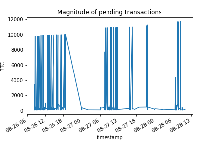
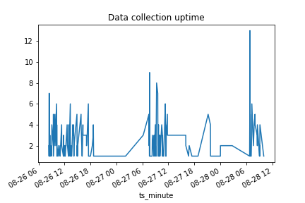
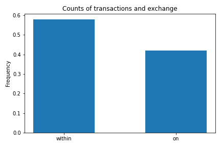
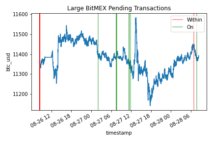
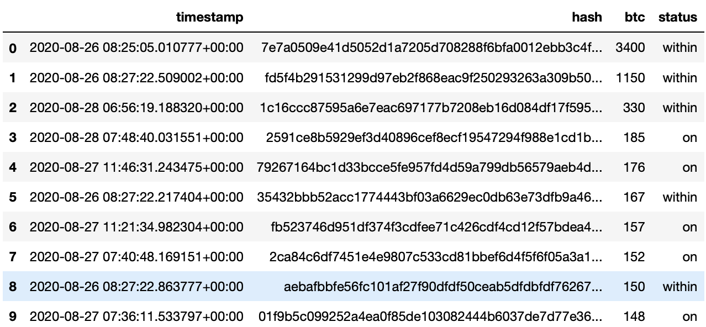
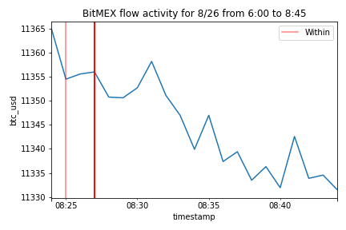
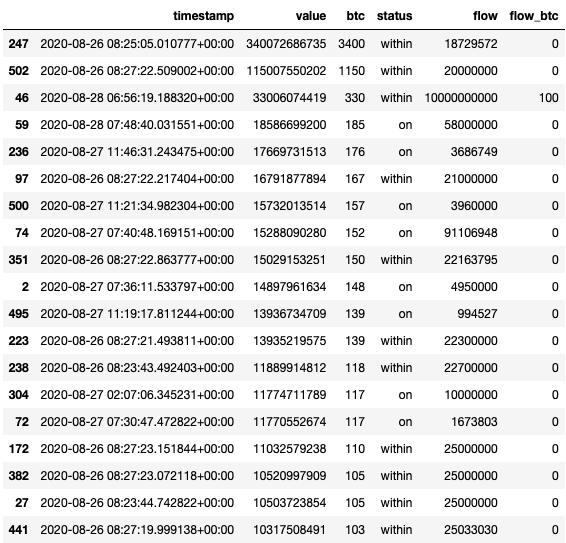
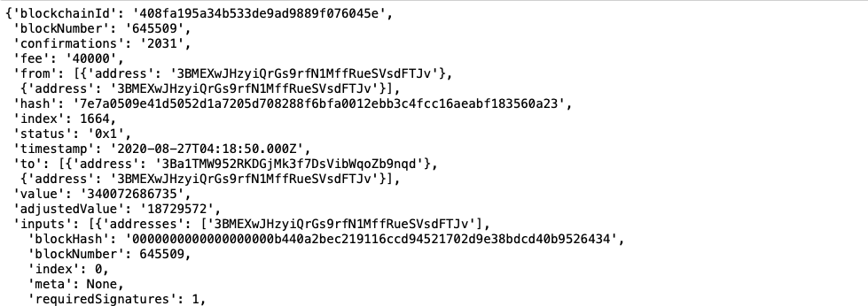

*Featured Photo by Sam Bark on Unsplash*

One of Bitcoin’s strengths and the thing that makes it unique in the finance world is its radical transparency. Blockchain data is like a window, you can see right through it.

But if Blockchain data is a window, it often feels less like the one in your apartment to look out of (solemnly during a pandemic, possibly), and more like this:


In blockchain data, the agents involved are obscured. There is no central agency that knows who is posting what transaction, but the data is all there for anybody to see, and it is often trying to tell a story.

Our goal in this blog post is to use blockchain data and discover one such story: the story of millions of dollars worth of digital currency in flight between sender(s) and recipient(s).

We aim to use the transparency of the blockchain to our advantage and observe our counterparties performing large transactions before they are even complete. This is an incredibly powerful ability, and we can leverage some brainpower and keyboard skills to get it done nearly for free.

In this post, we will touch on some of the same topics as one of my previous [posts](/2020/09/bitcoin-sharpe-ratio/), namely inflow and outflow and [BitMEX](https://www.bitmex.com/) wallets. We will also learn about topics such as the mempool, what a digital wallet is, how to listen to live streaming data using a tiny computer, and dig into (somewhat) raw blockchain data using Amberdata.

Amberdata's API unifies blockchain-network and cryptocurrency-market data, metrics, and reference rates into a single integration point making it delightful for data science. There are a lot of topics to cover here, so with that, let’s get started!

## What is the Bitcoin Mempool?
When a new transaction is submitted to the Bitcoin network, it first must get verified by each node in the network. After the transaction becomes verified, it is added to the node’s “mempool”, or list of pending transactions. When a new block is created, a miner fills the block with transactions from the mempool and mines the block, making the transaction a part of the blockchain. 

This is what we mean when we say that we can observe transactions “in flight” in the mempool: we can see the transactions and their information before the funds transfer. If I am a cryptocurrency trader, I might want to use this information to my advantage to identify how entities are sending money on the blockchain - something that is impossible to do in most traditional markets. Sounds easy, right? Here is where blockchain data gets a bit tricky, like that stained glass window.

If you'd like another explaination on this topic, I suggest this [guide](https://99bitcoins.com/bitcoin/mempool/) to get started.

## What is a Bitcoin Wallet?
If you are interested in purchasing and possibly trading cryptocurrency, you may set up a digital wallet with one of the many wallet providers out there. This wallet holds a “secret key” proving you have ownership over some amount of cryptocurrency on the network. In order for a friend or exchange to deposit some cryptocurrency into your wallet, you need to give them an address to send it to. However, this gets complicated because most modern digital wallets create a new address for each transfer as a safety measure. 

Most centralized exchanges such as Coinbase have adopted this safety measure as well. Coinbase also has a very clear [explaination](https://www.coinbase.com/learn/crypto-basics/what-is-a-crypto-wallet) of digital wallets on their website.

While this is great for you as a user because it protects your digital assets from being stolen, it makes it a lot harder for data miners such as myself to identify who is sending to whom. While this is not always the case, it starts to look more and more like every transaction is between new users, which is unhelpful. If you read my aforementioned post on BitMEX wallets you will know how we solved this problem for wallets on the BitMEX exchange, but I will summarize it here.

BitMEX is one of the most liquid Bitcoin exchanges, meaning it has some of the highest volume of Bitcoin and cryptocurrency trading. Fortunately for us, all BitMEX addresses start with either “3BMEX” or “3BitMEX”, making them very easy to identify. These sorts of things are not readily announced by the exchange itself, but according to some good sources and verifying with the data it appears that this seems to still be the case.

## Getting the Data
The volume of transaction data for a large network like Bitcoin is constant and sizable, so in order to get an accurate picture of its activity, it is a good idea to watch it live and parse out the signals we want to focus on. Our main data source will be Amberdata’s [Pending Transactions](https://docs.amberdata.io/reference?ref=hackernoon.com#ws-pending-transaction) Websocket, which is available with a free-tier Amberdata API key. They have a useful guide for getting up and running looking for evidence of large token transfers called [Real Time Asset Movement](https://amberdata.io/guides/whale-activity?ref=hackernoon.com), but since I am executing this analysis in Python I thought my method might be useful as well. 

Since we will need several days worth of data to find something interesting, I am opting to use a smaller device to save energy and keep my bedroom a little bit cooler. My device is a Raspberry Pi 3B upgraded to the newest version of Raspberry Pi OS 10: Buster. This version comes installed with Python 3.7 which we will need to run the data collection script. Speaking of data collection, now we get to the star of the show from the technical side: websockets.

## What are WebSockets?
Websockets are a way to get streaming data from an API. The two most useful tools for ingesting live data in Python are the [websockets](https://pypi.org/project/websockets/?ref=hackernoon.com) package and asyncio in the standard Python library. Websockets is actively maintained and I recommend it over websocket-client as it enforces good programming practices, including using asyncio. 

If you are not familiar with asyncio, it is a package for multithreading with some special functionalities which will be very useful for listening to streaming data. This [guide](https://realpython.com/async-io-python/?ref=hackernoon.com#async-io-design-patterns) by Real Python is great for getting up to speed with asyncio. Here is what my data collection function looks like using the websockets library:

<script src="https://gist.github.com/evanaze/b4fbb72ab176bdc6a1cc1e4ef2708b9b.js"></script>

In short, by starting our function with `async def` we are able to call the function and resume our program without waiting for it to return. We use this same methodology by using `await websocket.send(message)` The general form of the program is to open up a client and send the websocket server a message that says that we want to listen to the `pending_transaction` websocket for new events. Once the connection is established, we start an infinite loop with `while True` and listen for new events with `response = await asyncio.wait_for(websocket.recv(), timeout=25)`.

As the data comes in we process the data with a function called `on_response()` which essentially looks to see if the pending transaction is large enough - greater than our threshold - and logs it to our data file if so. In particular, we log the timestamp of when the pending transaction appeared in the mempool, the value of the pending transaction, who the transaction is from and the transaction’s recipients, the transaction hash, and whether this transaction is on, to/from, or not related to the BitMEX exchange. If you are unfamiliar with blockchain data, the transaction hash is just a unique identifier that allows us to find this particular transaction anytime, which we will make use of later when we check to see that the transactions went through.

As we log the transaction, we want to check if the sender or recipients are a part of our exchange of interest, so we have an idea of whether the money is trading on, from, or within the exchange. This actually tends to be a decent indicator of the market health of cryptocurrency. The more people putting money onto an exchange, the more bullish they are and vice-versa. In order to achieve this for BitMEX wallets, we can simply parse the addresses for “3BMEX” or “3BitMEX”, as mentioned above. But, I wanted to go a step further and use what is called a bloom filter.

## Bloom Filter
A [bloom filter](https://www.geeksforgeeks.org/bloom-filters-introduction-and-python-implementation/) is an efficient data structure for querying a list of items. It can answer the question “Is this object not in the list of items?” with certainty, but gives an answer with some margin of error when you ask it “is this object in the list of items?”. This makes it useful for lighter applications when you have up to millions or more items to search. In order to take advantage of this, I used my list of addresses from the BitMEX blog post to cross-reference each time we logged a new large transaction. 

You may not have such a nice algorithm for identifying exchange addresses on other exchanges, in which case you can keep a list of the exchange’s addresses you come across and use the bloom filter to check new transactions for exchange addresses as they come in. All said and done, you will probably also want a third process - possibly with a different machine or done after the data has been collected - to double-check the transactions to make sure the bloom filter did not miss any. 

## Getting Started
We will also make good use of the program [tmux](https://github.com/tmux/tmux) written in C for Linux machines. This is a very useful program and has become a standard part of my workflow since I have learned it for this blog post. Tmux starts a server session that allows your shell sessions to stay alive even after you leave, or the computer would regularly go to sleep. Its main use here is to keep the Python session alive and listening to the websocket indefinitely, but there are many more uses for tmux such as creating a customized dev environment, and much more.

If you would like to follow along or try this analysis yourself, you first need an Amberdata API Key to access the websocket. The full code for this blog post, along with the other blog posts in this series is available here, and for this post we will be focusing on the repository txn-mempool. I made sure that there are minimal packages to install, so you should be able to get up and running collecting data with just Python version 3.7 and the virtual environment manager of your choice. Now that we have that out of the way, we can move on to the fun part.

## The Analysis
I left my [Raspberry Pi](https://www.raspberrypi.org/) running for about one day listening to the Bitcoin mempool. I set my threshold for pending transactions greater than 100 Bitcoin, or transactions worth at least roughly $1.15 million. 

### Watching pending transactions (over a certain threshold) live
I captured mempool transactions periodically from August 26th, 2020 at 8:30 AM PST to the 28th at 8 AM. Plotting them in order of occurrence gives us this:



We can see that we observed basically two tiers of pending transactions. Small (in the scheme of things) transactions worth less than 1,000 Bitcoin (~$11 million) that happen frequently, and a good amount of pending transactions in the 10,000 Bitcoin range (~$100 million) and above. This may come as a surprise to some about the shocking amount of value constantly being transferred on the Bitcoin network. The overall distribution of pending transactions we recorded looks like this:
```
count      503
mean      1034
std       2613.3
min        100
25%        131
50%        211
75%        438
max      11711
```
The average pending transaction - excluding transactions under 100 BTC - was about 1034 BTC, but the median was lower at a little more than 200 BTC which indicates that there are some much larger transactions skewing the distribution.

As a side note, even though Tmux keeps a server alive so the listening program can continue to subscribe to data from the websocket, I was being silly and unplugged my machine for a couple of hours at a time. My Kindle shares the same charger, and I am also an avid reader. Here is what my data collection looks like in the time domain with downtime from unplugging my Raspberry Pi:



We will see the effect of this pop up later in the analysis, but for now we can just keep this in the back of our minds. Since our analysis is focused on keeping an eye on wallets on the BitMEX exchange, let’s translate this to transactions involving these BitMEX addresses. 

### Filtering out transactions to/from/on exchange
By talking about the money flow with respect to an exchange, we can get an idea of whether people are trading within the exchange, putting money into the exchange to trade, or taking the money out of the exchange. Putting money into an exchange possibly reflects bullish sentiment, because people are purchasing more Bitcoin to trade. Taking money out of the exchange, on the other hand, can reflect bearish sentiment. People might transfer out of the exchange to withdraw and put into a cold wallet, transfer to another exchange, or liquidate into USD or another currency.

As mentioned above, we use a bloom filter to identify pending transactions from an exchange on the fly and observe flows before they become completed transactions. If there is a BitMEX address in the “from” field, then we consider the transaction to be from or “off” the exchange. Similarly, if we find a BitMEX address in the “to” field, then the transaction is “on” the exchange. If both fields contain a BitMEX address then the transaction is “within” the exchange.

Only about 4% of the transactions we recorded occurred on the exchange. Here we ignore those transactions not related to BitMEX. Unfortunately, we were unable to record transactions that were only from or “off” the exchange. For the activity we did record, the split is about 40/60 of activity going to the exchange versus occurring within the exchange.



Now that we have a picture of the big transactions in flight on BitMEX, let’s plot them over price to get a picture of what was going on when the transaction was submitted.

### Plotting large exchange related transactions over price
We use Amberdata’s [OHLCV historical](https://docs.amberdata.io/reference?ref=hackernoon.com#get-historical-ohlc) endpoint to get minute level data on the close price of Bitcoin over this period. If you want to replicate this analysis, be aware that you can query at most 24 hours of data at this granularity at a time, but it is easy to just do a hopping window to collect as much data as you need. I combined the two data sources, and plotted the large pending transactions over the Bitcoin price, color coding each transaction on whether it was “on” or “within” the exchange.



In this part of the data, most of the pending transactions were going from outside addresses to the exchange so we were able to capture some live inflow onto BitMEX. Here’s what the transactions look like, sorted by value:



It looks like the largest of these pending transactions - by a long shot - were two right at the beginning of the observation period.



The first pending transaction, which actually occurred on my second minute of observation, is the largest pending transaction at 3400 btc. Even more interesting, two of the transactions occurred within the very same minute, one of which being the second largest transaction we observed in the mempool over the period. Mere milliseconds after a transaction was posted for over 1000 Bitcoin, another transaction in the same exchange posted for 150 Bitcoin. I looked into the addresses for both transactions and they don’t have any in common, so it is unclear whether the two are at all related.

There is another subtlety that we missed so far in the analysis. For example, the first transaction on the list actually only occurs between two unique addresses, and one of them is not a BitMEX address even though we listed the transaction as within. This is due to the way BitMEX processes a transaction. If a BitMEX wallet initiates a transfer to send funds, the sender will send their entire account balance as the input, and will receive their balance minus the amount they want to send and the fee in return. 

If you go through the “within” transactions, you will find that they are all of this form, meaning that they are simply a BitMEX transfer of funds to an outside account. So we found no BitMEX transfers within the exchange - i.e. from one BitMEX address to another, and only transfers out of the exchange.

Going back through our transactions on the exchange, we can now calculate the amount that either left the exchange as discussed, or the amount transferred onto the exchange. I did that with the following script:

<script src="https://gist.github.com/evanaze/8742808acd795a0aeb084d8e21f58de9.js"></script>

This script goes through the transactions that were labeled “within” and calculates the amount that was transferred to non-BitMEX addresses, and goes through the transactions labeled “on” and calculates the amount that was sent to BitMEX addresses. We use Amberdata’s [Single](https://docs.amberdata.io/reference?ref=hackernoon.com#get-transaction) endpoint to get the transaction data given the transaction hash. The results look as follows:



As we can see, only one transaction fits our description of a large flow greater than 100 btc. Somebody at about 7:00 AM PST on the 28th of August transferred 100 btc out of BitMEX. With this extra layer of code, we could zone in on transfers of Bitcoin in or out of an exchange just as they were posted to the network.

## Checking if the Transaction Went Through
Once we see that a large transaction has been posted in the mempool, we may want to check if or when it goes through. We can use Amberdata’s blockchain address [transaction](https://docs.amberdata.io/reference?ref=hackernoon.com#get-address-transactions) endpoint to see when the transaction gets mined into a block. Running this code, shows that the transaction got mined into block 645509 the next day, on the 27th of August.



Now let’s check and see if any of the top 10 transactions we’ve been looking at have been confirmed. Simply using the above code and looping through our top 10 addresses we can quickly see if any of the transactions have gone through yet.

Note: some of these addresses are much more active than the single one we looked at above, so we have to increase the number of records to return to 1000 per page. I welcome you to try this in the analysis Jupyter Notebook, but for now you can trust me that of the 19 transactions related to the exchange, all but three have gone through as of the time of writing.

```
Number of completed transactions: 16
Total transactions: 19
Percent completed: 84.2
```

## What Did We Learn?
If you stuck through with me to the end, congrats! We went through a lot of topics today. We learned about what a mempool is, why blockchain wallets can be so difficult to find, and took some first steps in calculating flows from Bitcoin transactions. From gathering the data, plotting flows over price, and checking completed transactions, Amberdata’s blockchain and market data API’s made gaining visibility into the mempool a breeze.

We also learned about some cool dev tools, such as tmux, the websockets library, bloom filters, and how to cheaply start listening to live blockchain data on a Raspberry Pi. Most importantly, we learned that we can discover large flows of currency just as they are submitted to a blockchain, often up to 24 hours before they are processed by the network.

If you are interested in trying out this analysis for yourself, you can check out the Github repository for this blog post [here](https://github.com/amberdata/evan-blog-posts/tree/master/txn-mempool?ref=hackernoon.com). I included the data from this analysis as a sample just to get started. 

## Sources
* Bitcoin’s Mempool: A Beginner's Explanation: https://99bitcoins.com/bitcoin/mempool/ 
* Coinbase - What is a Crypto Wallet?: https://www.coinbase.com/learn/crypto-basics/what-is-a-crypto-wallet
* Amberdata Pending Transaction Websocket: https://docs.amberdata.io/reference#address-mempool 
* Amberdata’s blockchain address transaction endpoint: https://docs.amberdata.io/reference#get-address-transactions 
* Amberdata’s OHLCV Historical Endpoint: https://docs.amberdata.io/reference#get-historical-ohlc 
* Amberdata’s Single Endpoint: https://docs.amberdata.io/reference#get-transaction 
* Track Asset Movement and Blockchain Events Guide: https://amberdata.io/guides/track-asset-movement-and-blockchain-events 
* Async IO in Python: https://realpython.com/async-io-python/#async-io-design-patterns 
* Websockets: https://pypi.org/project/websockets/ 
* Why Does a Bitcoin Wallet Address Change Constantly?: https://www.btcwires.com/round-the-block/why-does-a-bitcoin-wallet-address-change-constantly/ 
* GeeksForGeeks - Bloom Filters: https://www.geeksforgeeks.org/bloom-filters-introduction-and-python-implementation/ 