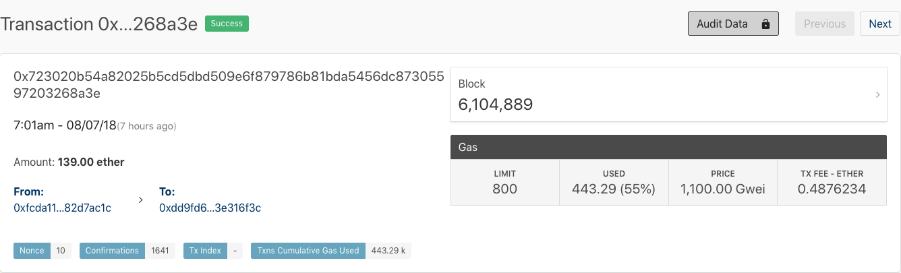
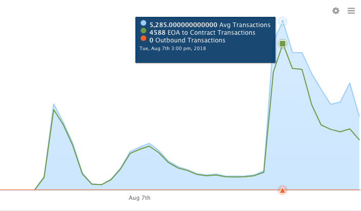

Photo by <a href="https://unsplash.com/@zoltantasi?utm_source=unsplash&utm_medium=referral&utm_content=creditCopyText">Zoltan Tasi</a> on <a href="https://unsplash.com/s/photos/ethereum?utm_source=unsplash&utm_medium=referral&utm_content=creditCopyText">Unsplash</a>
  
Early this morning, a new address originated a spam attack on the Ethereum network. Inspired by this [article](https://cryptovest.com/news/ethereum-network-overloaded-again-strong-suspicions-of-spam/) on Cryptovest, let’s take a quick look on how the Amberdata platform displays this activity.

The account in question operated transactions consuming upwards of 20% of the network gas usage this morning, taking up large space on the block and slowing the network. Our alert system identified this attack based on high gas costs and large Ether transfers. Notice the huge 1,100 Gwei gas price on the parent transaction:

The contract activity graph on the address’ dashboard shows this morning’s abnormal activity. It was transferred 92.4 Ether at the start of day, and appears to be a part of a bot run system to make high gas transfers on the Ethereum network.

This activity is a good use of our new anomaly detection feature which we are excited to roll out in a future release. It is estimated that today’s overload cost roughly $20,000 to those responsible with the effect of slightly higher transaction fee for “fast” transactions, according to the Ethereum gas station.