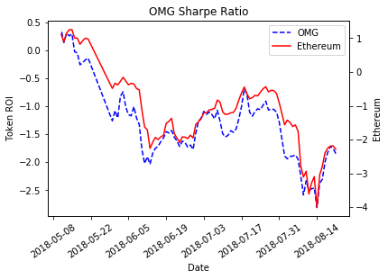
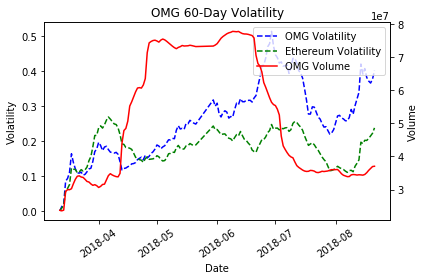
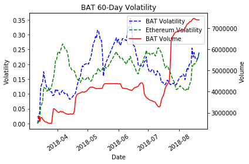

Photo by <a href="https://unsplash.com/@cardmapr?utm_source=unsplash&utm_medium=referral&utm_content=creditCopyText">CardMapr.nl</a> on <a href="https://unsplash.com/s/photos/cryptocurrency?utm_source=unsplash&utm_medium=referral&utm_content=creditCopyText">Unsplash</a>

Cryptocurrencies are naturally volatile assets, compared to more traditional assets such as stocks. One might wonder if this is going to change as time goes on, i.e. if Cryptocurrency value will stabilize in the near future. The article below does a great job covering some of the the properties and environmental causes that set crypto-assets apart from traditional assets. In other words, crypto-asset values are naturally [less predictable](https://snovian.space/blog/understanding-volatility-in-blockchain-tokens/) than their traditional counterparts, and that is unlikely to change any time soon.

Despite being more volatile in general, I’d like to share some insights that the volatility of a Cryptocurrency can provide.

## The Apple and the Tree
“Coupling” is a term that describes the high correlation of tokens within a network. In other words, the apple does not fall far from the tree — when Ethereum takes a hit, so do the tokens on its network. To the left is a graph of the Sharpe ratio, used to measure [ROI](/2018/08/roi-are-cryptocurrencies-good-investments/), of OMG coin as well as Ethereum which displays how similar these two assets behave over time. Below that is a 60-day averaged volatility graph of the same two tokens. From this we gather not only that Ethereum is consistency slightly more volatile and a better investment, but that changes in Ethereum’s value will reflect on OMG token.

“Decoupling” on the other hand, is exactly what you would expect, and it is much rarer to find in the crypto exchange than a traditional market. Utility tokens, for example, provide some service on top of their asset value and tend to be decoupled from their network. Below is the volatility graph of BAT token which indicates some decoupled behavior.

Knowing which tokens are more highly correlated with their network allows you to infer the behavior of coupled tokens based on the value of Ethereum, for example. Now, let’s go into a little more depth on volatility to see what it does and where it comes from.

## What is Volatility?
Volatility is simply the standard deviation or variance of the value of an asset over a time period. It gives a measure of the variability of an asset’s value. One might notice that volatility is *typically* a number between 0 and 1 as can be seen from the graphs above, and this is to allow comparison between tokens regardless of magnitude. The only time volatility will be larger than 1 is when it is more volatile than its own price on a given day… which is pretty scary to imagine.

The takeaway from all of this is simple: buying crypto during historically high volatility is a risky move, and likely to end at an unexpected outcome unless you have outside insight on the factors that may be influencing the volatility of your token, i.e. news developments, or an ICO.

Furthermore, when a token shares the same periods of stability and volatility as Ethereum, Bitcoin, etc. then it is likely that the token is coupled and will mirror the performance of its network.

At Amberdata, we are excited to bring this metric online as a part of our blockchain analytics platform, coming soon in a future release. Check out my previous blog posts here, or here to learn more about the metrics we think are important for informing the blockchain user.